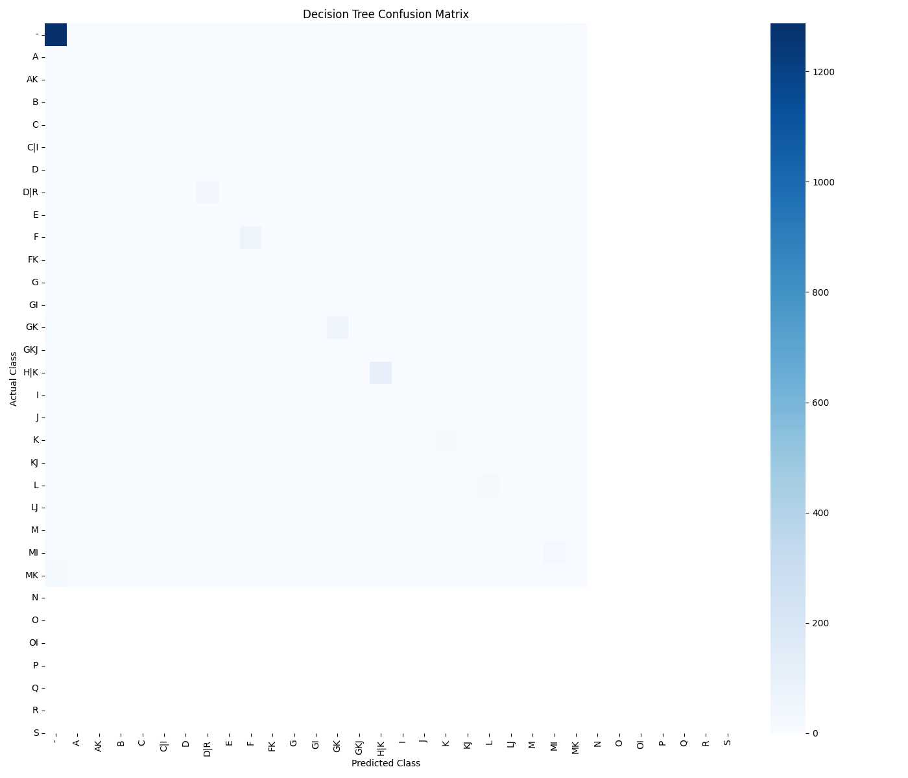

<h1 align="center">🩺 Thyroid Disease Prediction using Machine Learning</h1>

<p align="center">
Predicting thyroid disease categories using supervised machine learning with Decision Tree and Random Forest classifiers.
</p>

---

## 📌 Project Overview

This project implements a complete end-to-end machine learning pipeline for predicting thyroid disease categories using patient medical records.

The workflow covers data preprocessing, feature engineering, model training, evaluation, and visualization using Python and Scikit-learn.

---

## 🧠 Machine Learning Workflow

```text
                    Thyroid Dataset
                          │
                          ▼
                 Data Exploration
                          │
                          ▼
                 Data Cleaning
                          │
                          ▼
             Feature Engineering
                          │
                          ▼
        Label Encoding & One-Hot Encoding
                          │
                          ▼
                Train / Test Split
                          │
          ┌───────────────┴───────────────┐
          ▼                               ▼
   Decision Tree                  Random Forest
          │                               │
          └───────────────┬───────────────┘
                          ▼
                  Model Evaluation
                          │
                          ▼
        Accuracy • Classification Report
             • Confusion Matrix • Heatmap
```

---

## ✨ Features

- Dataset exploration
- Missing value handling
- Feature engineering
- One-Hot Encoding
- Label Encoding
- Decision Tree Classifier
- Random Forest Classifier
- Model comparison
- Classification Report
- Confusion Matrix
- Heatmap visualization
- Saved trained models (.pkl)

---

## 🛠 Tech Stack

| Category | Tools |
|----------|------|
| Language | Python |
| Data Processing | Pandas, NumPy |
| Machine Learning | Scikit-learn |
| Visualization | Matplotlib, Seaborn |
| Model Storage | Joblib |
| Version Control | Git & GitHub |

---

## 📂 Project Structure

```text
ThyroidPredictor/
│
├── data/
│   └── raw/
│       └── thyroid.csv
│
├── outputs/
│   ├── figures/
│   │   └── confusion_matrix_heatmap.png
│   │
│   └── models/
│       ├── decision_tree.pkl
│       └── random_forest.pkl
│
├── src/
├── main.py
├── requirements.txt
└── README.md
```

---

## 📊 Model Performance

| Model | Accuracy |
|-------|----------:|
| 🌳 Decision Tree | **93.0%** |
| 🌲 Random Forest | **92.3%** |

The Decision Tree achieved slightly better performance on this dataset.

---

## 📈 Confusion Matrix Heatmap

<p align="center">
  
</p>

The confusion matrix provides a visual summary of the model's prediction performance across all thyroid disease categories.

---

## 🚀 Getting Started

### Clone the repository

```bash
git clone https://github.com/GaRiMa-0019/ThroidPredictor.git
```

### Move into the project

```bash
cd ThroidPredictor
```

### Create a virtual environment

```bash
python3 -m venv .venv
```

### Activate the virtual environment

**macOS / Linux**

```bash
source .venv/bin/activate
```

**Windows**

```bash
.venv\Scripts\activate
```

### Install dependencies

```bash
pip install -r requirements.txt
```

### Run the project

```bash
python main.py
```

---

## 💡 Key Learnings

Through this project, I gained practical experience in:

- Preparing real-world medical datasets for machine learning.
- Handling missing values and preprocessing categorical data.
- Applying Label Encoding and One-Hot Encoding.
- Building supervised learning models using Decision Trees and Random Forests.
- Comparing machine learning models using evaluation metrics.
- Visualizing model performance using confusion matrices.
- Organizing machine learning projects with Git and GitHub.

---

## 🔮 Future Improvements

- Hyperparameter tuning using GridSearchCV.
- Cross-validation for more robust evaluation.
- ROC-AUC analysis for binary classification scenarios.
- Additional ensemble models such as XGBoost.
- Simple web interface using Streamlit or Flask.

---

## 👩‍💻 Author

**Garima Kushwaha**

B.Tech Computer Science (Data Science)

Passionate about Machine Learning, Data Science, Quantitative Finance, and building real-world AI projects.

---

⭐ *If you found this project interesting, feel free to fork the repository or leave a star.*